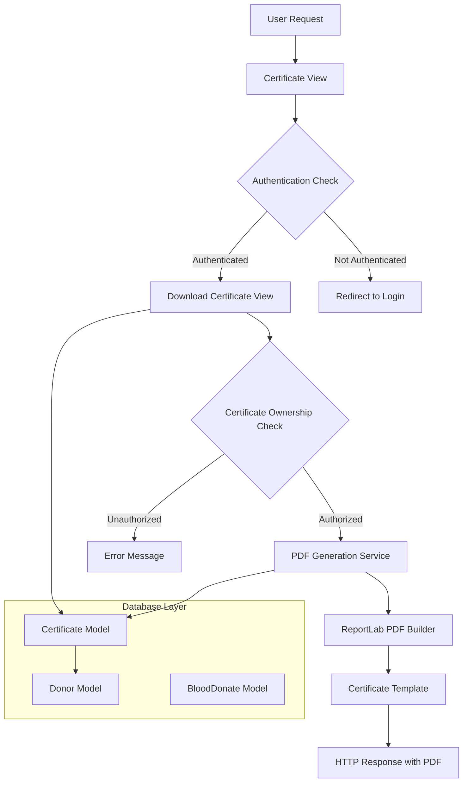
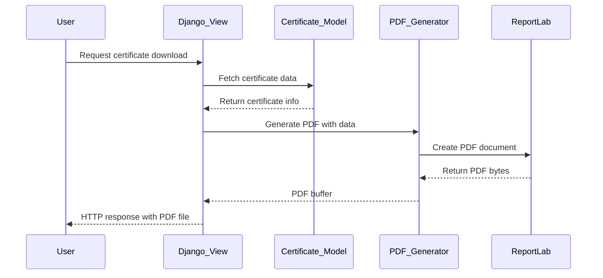
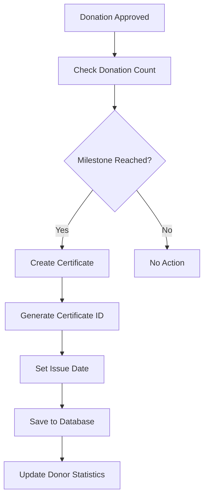

# Certificate PDF Generation and Download Feature Design

## Overview

This document outlines the design and implementation of the certificate PDF generation and download feature for the Blood Bank Management System. This feature enables blood donors to earn and download personalized PDF certificates based on their donation milestones, creating a gamification system to encourage continued blood donation.

## Repository Type

**Backend Application** - Django-based web application with integrated frontend components
- Primary technology: Django 4.2.16 framework
- Database: PostgreSQL/SQLite support
- PDF generation: ReportLab library integration
- Frontend: Django templates with modern CSS/JavaScript

## Architecture

### Component Overview



### Data Flow Architecture



## Certificate System Design

### Certificate Types and Milestones

| Certificate Type | Donation Count | Description |
|------------------|----------------|-------------|
| First Time Donor | 1 donation | Initial recognition for first blood donation |
| Regular Donor | 5+ donations | Acknowledgment for consistent donation habits |
| Hero Donor | 10+ donations | Recognition for significant contribution |
| Life Saver | 20+ donations | Honor for substantial life-saving impact |
| Blood Champion | 50+ donations | Elite status for exceptional dedication |

### Automatic Award System



## API Endpoints Reference

### Certificate Management Endpoints

#### View Certificates
- **URL**: `/donor-certificates`
- **Method**: GET
- **Authentication**: Required (Donor only)
- **Response**: HTML page with certificate list and statistics

#### Download Certificate
- **URL**: `/download-certificate/<certificate_id>`
- **Method**: GET
- **Authentication**: Required (Certificate owner only)
- **Response**: PDF file attachment
- **Content-Type**: `application/pdf`
- **Error Handling**:
  - 404: Certificate not found
  - 403: Unauthorized access
  - 500: PDF generation failure

### Request/Response Schema

#### Certificate Data Structure
```python
{
    'certificate_id': 'string (UUID)',
    'donor': 'Foreign Key to Donor',
    'certificate_type': 'Choice Field',
    'donation_count': 'integer',
    'issued_date': 'datetime',
    'get_certificate_type_display()': 'formatted string'
}
```

#### PDF Generation Response
```python
{
    'Content-Type': 'application/pdf',
    'Content-Disposition': 'attachment; filename="certificate_{id}.pdf"',
    'body': 'binary PDF data'
}
```

## Data Models & ORM Mapping

### Certificate Model
```python
class Certificate(models.Model):
    CERTIFICATE_TYPES = [
        ('FIRST_DONATION', 'First Time Donor'),
        ('REGULAR_DONOR', 'Regular Donor'),
        ('HERO_DONOR', 'Hero Donor'),
        ('LIFE_SAVER', 'Life Saver'),
        ('BLOOD_CHAMPION', 'Blood Champion'),
    ]
    
    certificate_id = models.UUIDField(unique=True)
    donor = models.ForeignKey(Donor, on_delete=models.CASCADE)
    certificate_type = models.CharField(max_length=20, choices=CERTIFICATE_TYPES)
    donation_count = models.PositiveIntegerField()
    issued_date = models.DateTimeField(auto_now_add=True)
```

### Related Models
- **Donor Model**: Links to User model, contains donation statistics
- **BloodDonate Model**: Records individual donation transactions
- **User Model**: Django built-in authentication model

## Business Logic Layer

### Certificate Generation Logic

#### Milestone Detection Algorithm
```python
def check_and_award_certificates(donor):
    donation_count = BloodDonate.objects.filter(
        donor=donor, status='Approved'
    ).count()
    
    milestones = {
        1: 'FIRST_DONATION',
        5: 'REGULAR_DONOR',
        10: 'HERO_DONOR',
        20: 'LIFE_SAVER',
        50: 'BLOOD_CHAMPION'
    }
    
    for count, cert_type in milestones.items():
        if donation_count >= count:
            # Award certificate if not already exists
            if not Certificate.objects.filter(
                donor=donor, certificate_type=cert_type
            ).exists():
                create_certificate(donor, cert_type, donation_count)
```

#### PDF Generation Service
```python
def generate_certificate_pdf(certificate):
    # Initialize PDF document
    buffer = BytesIO()
    doc = SimpleDocTemplate(buffer, pagesize=A4)
    
    # Configure styles
    styles = getSampleStyleSheet()
    title_style = customize_title_style(styles['Title'])
    
    # Build content
    story = build_certificate_content(certificate, styles)
    
    # Generate PDF
    doc.build(story)
    return buffer.getvalue()
```

### Security and Authorization

#### Access Control Matrix
| User Type | View Certificates | Download Own | Download Others |
|-----------|------------------|--------------|-----------------|
| Donor | ✓ (Own only) | ✓ | ✗ |
| Patient | ✗ | ✗ | ✗ |
| Admin | ✓ (All) | ✓ (All) | ✓ (All) |

#### Authorization Checks
```python
def verify_certificate_access(user, certificate):
    if is_donor(user):
        return certificate.donor.user == user
    elif is_admin(user):
        return True
    return False
```

## Middleware & Interceptors

### PDF Generation Middleware
- **ReportLab Availability Check**: Graceful fallback when library unavailable
- **Error Handling**: Comprehensive exception management for PDF generation
- **Performance Optimization**: Caching for frequently generated certificates

### Security Middleware
- **CSRF Protection**: Django built-in protection for form submissions
- **Authentication Enforcement**: Login required decorators
- **Authorization Validation**: Role-based access control

## Testing Strategy

### Unit Testing Framework
- **Django TestCase**: For model and view testing
- **Mock PDF Generation**: Test PDF creation without actual file generation
- **Database Isolation**: Separate test database for clean testing environment

### Test Coverage Areas

#### Model Testing
```python
def test_certificate_creation():
    # Test automatic certificate generation
    # Test milestone detection logic
    # Test certificate uniqueness constraints

def test_certificate_display():
    # Test certificate type display methods
    # Test date formatting
    # Test donor relationship integrity
```

#### View Testing
```python
def test_certificate_download_authorized():
    # Test successful PDF download for certificate owner
    
def test_certificate_download_unauthorized():
    # Test access denial for non-owners
    
def test_pdf_generation_unavailable():
    # Test graceful handling when ReportLab unavailable
```

#### Integration Testing
```python
def test_end_to_end_certificate_flow():
    # Test donation approval → certificate creation → PDF download
    
def test_milestone_progression():
    # Test multiple donations leading to progressive certificates
```

### Performance Testing
- **PDF Generation Speed**: Benchmark certificate creation time
- **Memory Usage**: Monitor buffer management during PDF generation
- **Concurrent Downloads**: Test multiple simultaneous certificate downloads

## Error Handling and Edge Cases

### Exception Management
```python
class CertificateError(Exception):
    """Base exception for certificate-related errors"""

class PDFGenerationError(CertificateError):
    """Raised when PDF generation fails"""

class CertificateNotFoundError(CertificateError):
    """Raised when certificate doesn't exist"""

class UnauthorizedAccessError(CertificateError):
    """Raised when user lacks certificate access"""
```

### Graceful Degradation
- **ReportLab Unavailable**: Show error message with admin contact
- **Network Issues**: Retry mechanism for PDF download
- **Database Errors**: Fallback to cached certificate data

## Configuration Management

### Required Dependencies
```python
# requirements.txt entries
reportlab==4.4.3  # PDF generation
pillow==11.3.0    # Image handling for certificates
```

### Environment Configuration
```python
# settings.py
CERTIFICATE_SETTINGS = {
    'PDF_GENERATION_ENABLED': True,
    'CERTIFICATE_CACHE_TIMEOUT': 3600,  # 1 hour
    'MAX_PDF_SIZE': 5 * 1024 * 1024,   # 5MB
}
```

## Future Enhancements

### Advanced PDF Features
- **Custom Templates**: Allow certificate design customization
- **Digital Signatures**: Add cryptographic signatures for authenticity
- **QR Code Integration**: Include verification QR codes
- **Multi-language Support**: Certificates in multiple languages

### Analytics and Insights
- **Download Tracking**: Monitor certificate download patterns
- **Donor Engagement Metrics**: Analyze gamification effectiveness
- **Certificate Performance**: Track which certificates motivate most donations

### Integration Possibilities
- **Email Delivery**: Automatic certificate email sending
- **Social Media Sharing**: Direct sharing to social platforms
- **Mobile App Integration**: API endpoints for mobile certificate access
- **Blockchain Verification**: Immutable certificate verification system
